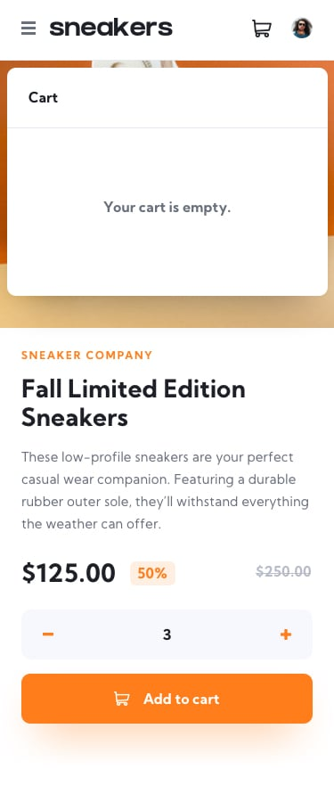

# Frontend Mentor - E-commerce product page solution

This is a solution to the [E-commerce product page challenge on Frontend Mentor](https://www.frontendmentor.io/challenges/ecommerce-product-page-UPsZ9MJp6). Frontend Mentor challenges help you improve your coding skills by building realistic projects.

## Table of contents

- [Overview](#overview)
  - [The challenge](#the-challenge)
  - [Screenshot](#screenshot)
  - [Project Features](#project-feature)
  - [Links](#links)
- [My process](#my-process)
  - [Built with](#built-with)
  - [What I learned](#what-i-learned)
  - [Continued development](#continued-development)
  - [Useful resources](#useful-resources)
- [Author](#author)
- [Acknowledgments](#acknowledgments)

## Overview

### The challenge

Users should be able to:

- View the optimal layout for the site depending on their device's screen size
- See hover states for all interactive elements on the page
- Open a lightbox gallery by clicking on the large product image or any of the thumbnails
- Switch the large product image by clicking on the small thumbnail images or navigation arrows
- Add items to the cart
- View the cart and remove items from it

### Screenshot


### Project Features Screenshots





### Links

- Solution URL: https://github.com/zDevtutor/ecommerce-product-page
- Live Site URL: https://ecommerce-product-page-five-peach.vercel.app/

### Built with

- [React](https://reactjs.org/) - JS library
- CSS Modules

### What I learned

- I learned about the pointer-event property which I used it to prevent the onClick events attached to the images on small devices.
- I learned about useMemo() hook for extra optimization and increase preformance.

```

## Author

- Website - [Mostafa sayed](https://github.com/zDevtutor)
- Frontend Mentor - [@zDevtutor](https://www.frontendmentor.io/profile/zDevtutor)

```
